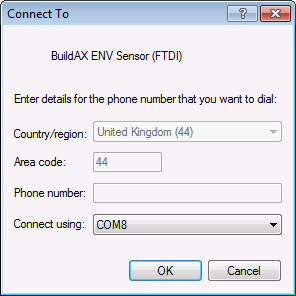
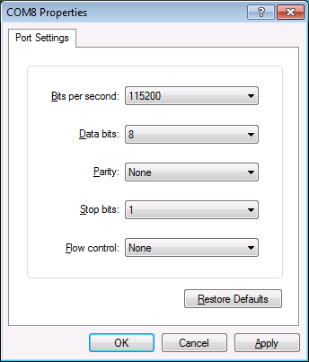
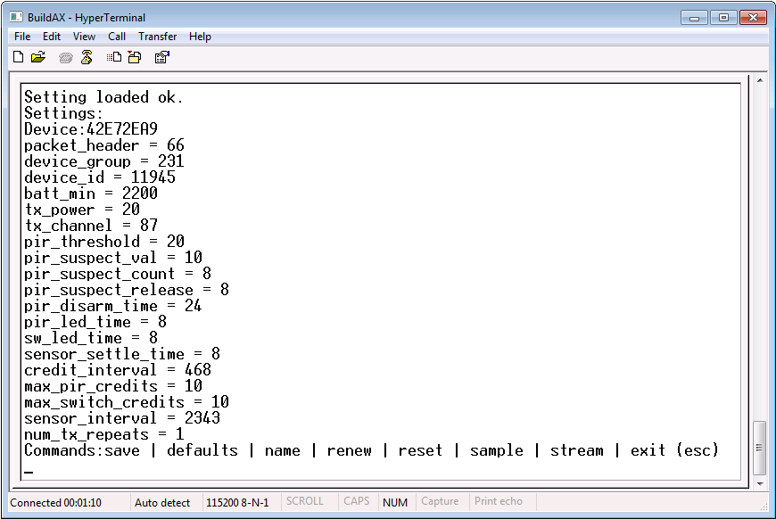

[//]: # (LRS Connection Guide)

# Connecting to the BuildAX LRS

Multiple methods of connecting to the LRS are supported- these fall into 
two categories: a text-mode command interface, and a web configuration 
interface.


## Serial (USB)

The serial connection is available when the LRS is directly connected to a 
PC via the USB cable. To access a serial connection, some additional (free)
software is required. We have tested using the following apps on these 
platforms:

 * __Windows__: [Hyperterminal](#),[PuTTy](http://www.chiark.greenend.org.uk/~sgtatham/putty/)
 * __Linux__ / __Mac OSX__: [GNU screen](http://www.gnu.org/software/screen/), [CoolTerm](http://freeware.the-meiers.org/)


### Microsoft Windows

The device will appear as a COM port on Windows (can be found in the Device 
Manager, Hyperterminal will also enumerate serial ports). The COM port number 
will usually be COM2 or above (COM1 is now a virtual interface on modern 
Windows).

### Linux, OSX (*nix platforms)

Devices on *nix platforms are listed under the `/dev/` directory. 


## USB Mass Storage

Finally, data files logged by the LRS can be retrieved directly by using 
it as a USB Mass Storage device. For this option to be available, data 
logging on the LRS must be disabled (this is because it would be 
unsafe to continue writing data to files which could be read at any time).

To override this, use the `mount` command.


<span class="alert alert-warn"> 
**Warning:** Manually deleting (or otherwise removing) data files from the mass storage device may cause the 
data fetch service to become unstable.
</span>


## Network Access

When the BuildAX LRS is connected to your network using an Ethernet cable, it 
will request an IP address using DHCP.

On home networks, the IP address assigned will normally be of the form
192.168.x.x. On corporate or academic networks you may need to request an
address from your network administrator, quoting the device's MAC address. 
They may also be able to assign a DNS address for convenient access.

### Finding the IP address
The MAC and IP address assigned to the LRS may be discovered by connecting 
via serial and typing `status`. You may also find it useful to assign a static 
IP address to the device for the purposes of port forwarding.


### Telnet

Telnet can be used to access the LRS command terminal over the network 
without needing to plug the USB cable into a PC. All of the commands listed in 
[Commands (LRS)](commands-lrs.md) are supported.

The `telnet` command is used to connect to this console:


````
	telnet 192.168.0.15
````

... or use PuTTy on Windows. The LRS's telnet service runs on the default 
TCP port 23.


### Web Interface (HTTP)

The BuildAX LRS configuration interface is accessed using a web browser, 
providing a convenient way to change settings and view LRS status without
needing to use the text-mode terminal. 

On Windows, type the NETBIOS name of the device may be typed directly into the
address bar. This will be in the form BAX-xxxxxx (e.g. `bax-434c32`), and can 
be found on the sticker on the rear of the device.

For information on using the web interface, please see the [Web Interface User Guide](user-guide.md).


---
# Connecting to a BuildAX ENV Sensor

In order to configure settings on the BuildAX ENV sensors, you may connect 
directly to the sensor using an FTDI cable. You will require a VCP (Virtual 
COM port) USB driver for FTDI, available [here](http://www.ftdichip.com/FTDrivers.htm).

This guide demonstrates how to connect to an ENV sensor using HyperTerminal.
On other operating systems, the settings will be the same, though the procedure
may differ.

For information on flashing firmware to the device, please refer to the 
[Firmware](firmware.md) section.

On creating a new serial connection with HyperTerminal, you should select the 
new COM port created by the FTDI driver (this will usually be a number greater
than COM1). 



Hyperterminal will enumerate the COM serial ports available on the system, as
in this example. To connect using PuTTy, you will need to find the COM port
number using the Device Manager in Windows, or use a fork of the project with
COM enumeration. 

To connect on a Unix platform, the `screen` command may be 
used along with the device path (under `/dev/`). Details of using this command
for serial connections can be found [here](https://wiki.archlinux.org/index.php/working_with_the_serial_console#Screen).

All connection methods will require configuration with the correct serial parameters.


## Connection Settings

 * __Baud Rate__:    115200
 * __Data bits__:    8
 * __Parity__:       None
 * __Stop bits__:    1
 * __Flow control__: None



 Select "OK", and the FTDI Serial connection will be open, ready to connect a
 sensor.

### Connecting to ENV sensors

Starting from the corner of the sensor and working inwards, the following FTDI
wires should be connected to the 3-pin connector:

 1. Orange (pin 1)
 2. Black  (pin 2)
 3. Yellow (pin 3)

Your FTDI cable may also have Red, Brown and Green wires, these are not 
used by the ENV sensor and should be left disconnected.

To connect to an ENV sensor:

 0. Insert batteries into the sensor (if they are not already inserted)
 1. Push the 3 pins (listed above) of the FTDI connector onto the header 
    ([see item __1__ here](hardware.md#rear)), with the orange wire on pin 1.
 2. Press the sensor button ([see item __2__ here](hardware.md#rear)) to enter into command mode.
 3. Watch your command terminal. The sensor should start up and print its status over the connected UART:



Note that while the FTDI cable will provide a voltage and power the sensor, 
it is recommended that batteries are left in the device while the the serial 
connection is accessed. 


