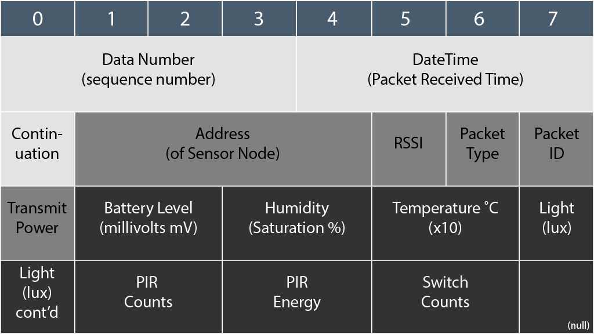

# BAX Data File Format

## CSV 

CSV Format data is logged to files named `LOGxxxxx.TXT` on the SD card when
the logging format is set to plaintext mode. It can also be streamed over the 
serial console and telnet.

A CSV formatted packet from a BuildAX Environment Sensor looks like this:


````
	2014/08/29,09:26:05,Bedroom,-48,1,171,0,2911,50.25,220,241,13876,36099,25
````

### Field List

 Field Name     | Data Type                      
 -------------- | -----------
 Date           | YYYY/MM/DD formatted ISO 8601 date of the packet
 Time           | HH:MM:SS formatted time the packet was received at
 Name           | The sensor's name, or its address if none has been assigned
 RSSI           | Received Signal Strength Indication, in dBm
 Type           | Received packet type. See [Packet Types](#packet-types) for full definition
 Sequence No.   | Packet identifier (sensors send packets incrementally)
 Transmit Power | Sensor-configured transmission power in dBm 
 Battery        | Battery level, in millivolts, of the BAX sensor
 Humidity       | Relative Humidity (percentage of the saturation vapour pressure)
 Temp           | Temperature in degrees Celsius (°C), multiplied by 10.
 Light          | Luminous flux measurement in Lux
 PIR Count      | Activation counts of the Passive Infra-red sensor 
 PIR Energy     | PIR energy last captured
 Switch         | Magnetic switch triggers on the device


### Packet Types

The type of a BAX packet indicates its transmission source. Listed here are
the currently defined packet types:

 ID    | Type
 ----- | ------
 0     | Encryption packet type (not seen in CSV output)
 1     | Normal Packet RX'd at sensor transmit interval
 2     | Packet sent when PIR sensor triggered
 3     | Packet sent when Magnetic Switch triggered 

Further packet types will be defined as more types of BAX sensor are 
developed. 


## Binary

The binary format can be converted into CSV using the `bax2csv` utility found
in the OpenMovement repository. The utility is designed to compile on most
machines with a Make and GCC environment.

Binary BAX packets are 32 bytes long. The layout of the binary packet is 
similar to how it is rendered in CSV. The data type widths are described below:


