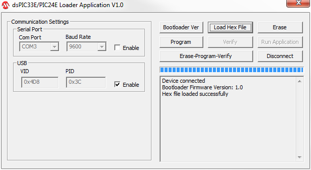

# Device Firmware

Firmware updates for BuildAX devices will be provided as a .hex file. This 
document describes the process of flashing the devices with updated firmware.

 
**Warning:** Updating the firmware is a potentially risky process. If you 
flash a device with an incorrect firmware file you could render it permanently unusable.

## BuildAX LRS

### Putting the LRS into bootloader mode

Remove the USB power connector from the LRS. Hold down the button on the 
rear of the device and connect the USB cable between the PC and the LRS. 
The LRS should enter bootloader mode, indicated by the LEDs counting up 
from 1-7 continuously. 

### Connecting to the PC 

Open the firmware flashing tool provided in the OpenMovement repository. 
Tools for other platforms may be available online.

Enable the USB checkbox. The Vendor ID should be `0x4D8`, and the Product ID  
`0x03C`. Now hit the "Connect" button. The tool should show that it has 
connected to the device.

 

Next, click "Load Hex File" and select the new firmware. Then, click
"Erase-Program-Verify", and the new firmware will be written to the device.

When this is completed, "Run Application" will cause the LRS to exit
bootloader mode. If using a USB wall power adaptor, it is now safe to remove 
the device from the PC and re-connect it to its own adapter.

#### Reset ALL Settings (re-generate MAC address)

To permanently reset all settings, including assigning a new random MAC address,
hold the button on the rear of the LRS and click "Run Application" at this
stage. Note that this may result in the LRS not being able to access the
network if you have used the device's old MAC address to assign it an IP.

### Video
**TODO**

## BuildAX Sensor node

### FTDI Cable
To flash BuildAX sensor firmware, a suitable FTDI cable is required.

### Video
**TODO**
