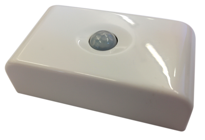

[//]: # (BuildAX Hardware walkthrough, including the router and sensors)

# Router
The BuildAX router is primarily a data-logger for the BAX sensors, but has 
a lot of extra functionality which you may find useful in a wide range of
deployment scenarios.

 

### LED codes

 

The BAX Router includes 7 LEDs which indicate the status of the device:

 LED | Function
 --- | ----------
  1  | Power
  2  | USB CDC (Serial connection available)
  3  | Network Connected
  4  | SD Card Mounted
  5  | Log File Activity
  6  | 434MHz Radio Activity
  7  | Remote connection (telnet) active

#### LED Flash Codes

There are a number of situations where a flashing pattern will be displayed on
the router LEDs:

 Pattern                              | Meaning               | Action
 ------------------------------------ | --------------------- | --------
 Odd/even LEDs flash alternately      | Pairing Mode          | Hold the button on the rear of the router for __1 second__. The router will enter [pairing mode](#pairing-mode). Proceed to pair up BAX sensors.
 2 groups of 3 LEDs flash alternately | Mount USB device      | Hold the button on the rear of the device for __5 seconds__. This will mount (or unmount) the USB disk, and re-initialise the filesystem. The Si44 Radio will also be re-initialised.
 All LEDs flash quickly, twice        | Load Factory Defaults | Hold the button on the rear of the router for __10 seconds__. This will reset the device to factory defaults but will not wipe files from the SD card (sensors will remain paired).
 All LEDs flash slowly, continuously  | General Exception     | A fatal router firmware error occurred. This usually signifies that there is a bug which will need to be fixed. Please send us your `ERRORS.TXT` from the SD card to help diagnose the problem.

### Connections

 

 No. | Function       | Description
 --- | -------------- | -------------
  1  | Pairing Button | Used to make the router enter [pairing mode](deployment.md#pairing-sensors), in which BAX sensors may be paired to the device.
  2  | SD Card Slot   | Accepts any SD card formatted with the FAT filesystem
  3  | Ethernet Jack  | Used for connecting the BAX Router to a TCP/IP network
  4  | Debugger Jack  | Debugging interface for firmware development
  5  | USB B Jack     | Provides power to the router. Also exposes a USB CDC Serial connection and Mass Storage Device to access the SD card
  6  | 434MHz Antenna | 434MHz Radio receives data packets from BAXv2 sensors

 ---

# Sensors

## BuildAX 2 Sensor Node

The BuildAX Router is designed to receive data from a variety of sensor nodes. 
The currently available device is the BuildAX 2 Environmental Sensor Node.

 

This is a small, indoor environment sensor which transmits the following 
values:

+ Temperature
+ Humidity
+ Light
+ PIR (Passive Infrared movement sensor)
+ Switch

#### Front

 

The PIR sensor by default shows a red LED when triggered, similar to those 
found in security/alarm systems. This indicates that the sensor node is 
working correctly. 

A green LED is displayed when the magnetic switch is triggered, or when the
button inside the device is pressed to send and encryption packet.

#### Rear

The back panel of the device is removed to reveal the battery compartment and
other components.

 

 No. | Function           | Description
 --- | ------------------ | -------------
  1  | FTDI Header        | A connector used to configure the device, and program the BAX Sensor firmware
  2  | Pairing Button     | Press this to send the sensor's encryption packet. See [Pairing Sensors](deployment.md#pairing-sensors) for full instructions on pairing sensors to the router.
  3  | Antenna            | 433MHz Radio antenna for sending BAX sensor data to the router wirelessly.
  4  | Battery Holder     | Two AAA (triple A) batteries power the BAX sensor, expected battery life is over a year with the default configuration
  5  | Temperature Sensor | Temperature sensor (±1% accuracy point-matched thermistor)
  6  | Humidity Sensor    | Humidity sensor (±5% accuracy between 20-90% RH)

The inclusion of a magnetic switch allows the sensor to be mounted on a door
or window frame, and transmit data on whether the aperture is open or closed.

A magnet similar to those used on cupboard doors should trigger the switch,
and should be aligned on the opposite side of the device to the antenna.

