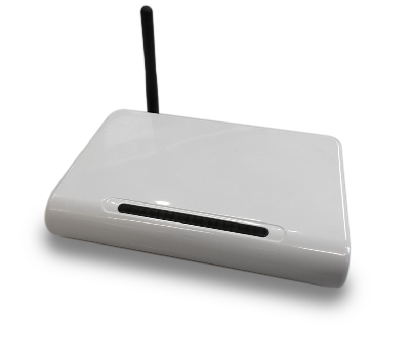
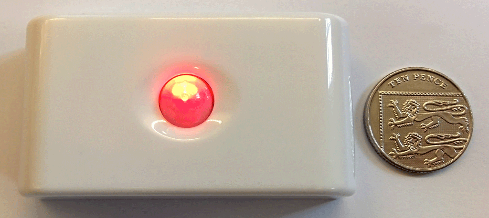
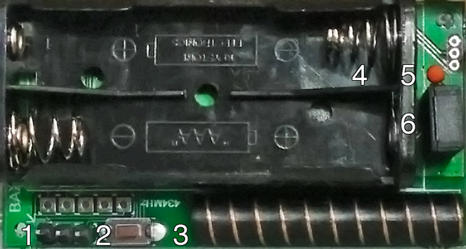

[//]: # (BuildAX Hardware walkthrough, including the LRS and sensors)

# LRS
The BuildAX LRS (Logger Router Server) is primarily a data-logger , but has 
a lot of extra functionality which you may find useful in a wide range of
deployment scenarios.

 

### LED codes

 

The BuildAX LRS includes 7 LEDs which indicate the status of the device:

 LED | Function
 --- | ----------
  1  | Power
  2  | USB CDC (Serial connection available)
  3  | Network Connectivity
  4  | SD Card Mounted
  5  | Log File Activity
  6  | 433MHz Radio Activity
  7  | Remote connection (telnet) active

#### LRS LED Flash Codes

There are a number of situations where a flashing pattern will be displayed on
the LRS LEDs:

 Pattern                              | Meaning               | Action
 ------------------------------------ | --------------------- | --------
 Odd/Even LEDs flash alternately      | Pairing Mode          | Hold the button on the rear of the LRS for __1 second__. The LRS will enter [pairing mode](#pairing-mode). Proceed to pair up BuildAX sensors.
 2 groups of 3 LEDs flash alternately | Mount USB device      | Hold the button on the rear of the device for __5 seconds__. This will mount (or unmount) the USB disk, and re-initialise the filesystem. The Si44 Radio will also be re-initialised.
 All LEDs flash quickly, twice        | Load Factory Defaults | Hold the button on the rear of the LRS for __10 seconds__. This will reset the device to factory defaults but will not wipe files from the SD card (sensors will remain paired).
 LEDs flash counting up from 1-7 continually |  Bootloader Mode | The device is in bootloader mode. This is triggered by holding the button on the rear of the device while the power is being connected. See the [Firmware](firmware.md) page for more info.
 All LEDs flash slowly, continuously  | General Exception     | A fatal LRS firmware error occurred. This usually signifies that there is a bug which will need to be fixed. Please send us your `ERRORS.TXT` from the SD card to help diagnose the problem.

### Connections

 

 No. | Function       | Description
 --- | -------------- | -------------
  1  | Pairing Button | Used to make the LRS enter [pairing mode](deployment.md#pairing-sensors), in which BuildAX sensors may be paired to the device.
  2  | SD Card Slot   | Accepts any SD card formatted with the FAT filesystem
  3  | Ethernet Jack  | Used for connecting the BuildAX LRS to a TCP/IP network
  4  | Debugger Jack  | Debugging interface for firmware development
  5  | USB B Jack     | Provides power to the LRS. Also exposes a USB CDC Serial connection and Mass Storage Device to access the SD card
  6  | 433MHz Antenna | 433MHz Radio receives data packets from BuildAX sensors

 ---

# Sensors

## BuildAX ENV

The BuildAX LRS is designed to receive data from a variety of sensor nodes. 
The currently available device is the BuildAX ENV (environmental sensor node).

 

This is a small, indoor environment sensor which transmits the following 
values:

+ Temperature
+ Humidity
+ Light
+ PIR (Passive Infrared movement sensor)
+ Magnetic Reed Switch

### Front

 

The PIR sensor by default shows a red LED when triggered, similar to those 
found in security/alarm systems. This indicates that the sensor node is 
working correctly. 

A green LED is displayed when the magnetic switch is triggered, or when the
button inside the device is pressed to send an encryption packet.

### Rear

The back panel of the device is removed to reveal the battery compartment and
other components.

 

 No. | Function           | Description
 --- | ------------------ | -------------
  1  | FTDI Header        | A connector used to configure the device, and program the BuildAX Sensor firmware
  2  | Pairing Button     | Press this to send the sensor's encryption packet. See [Pairing Sensors](deployment.md#pairing-sensors) for full instructions on pairing sensors to the LRS.
  3  | Antenna            | 433MHz Radio antenna for sending BuildAX sensor data to the LRS wirelessly.
  4  | Battery Holder     | Two AAA (triple A) batteries power the BuildAX sensor, expected battery life is over a year with the default configuration
  5  | Temperature Sensor | Temperature sensor (1% accuracy point-matched thermistor)
  6  | Humidity Sensor    | Humidity sensor (5% accuracy between 20-90% RH)

The inclusion of a magnetic switch allows the sensor to be mounted on a door
or window frame, and transmit data on whether the aperture is open or closed.

A magnet similar to those used on cupboard doors should trigger the switch,
and should be aligned on the opposite side of the device to the antenna.

### ENV LED Flash Codes

 Pattern                              | Meaning
 ------------------------------------ | ------------------------- 
 RED flash                            | PIR event (event detected)
 GREEN flash                          | Magnetic switch event (either direction of magnet movement)
 RED-GREEN-RED-GREEN-RED-GREEN flash  | Device reset(e.g. reset command or new batteries)
 GREEN-OFF-GREEN-OFF-GREEN-OFF        | Device settings invalid or encryption+id changed (e.g. button hold + new batteries)               
 RED dim flicker at 1 Hz              | Device battery depleted (remove depleted cells to avoid cell leakage)             

### Device control

 Pattern                              | Meaning
 ------------------------------------ | ------------------------- 
 Press button ( <10 seconds)          | <ul><li>    LED Flashes at 1Hz Green    </li><li>    Encryption data is transmitted at low power (short range)    </li><li>    Sensor data is transmitted at normal power    </li><li>    Full event credits are granted    </li></ul>
 Hold button for 10 seconds           | <ul><li>    LED turns red    </li><li>    Factory default settings are latched     </li><li>    Device will reset on button release    </li></ul>
 Connect cable and press button        | Device enters settings mode immediately
 Insert batteries while holding button | Device factory resets AND generates new id and encryption

--- 
## Sensor Specification

Full specification of the BuildAX ENV sensor hardware:

### Battery power

 * 2 standard AAA cells
 * Battery life depends on usage and location e.g. for a 900 mAh typical alkaline battery:
    + Sensor sample every minute + 1 event every minute = __ ~0.5 Years __
    + Sensor sample every 5 minutes + 50 events per day = __ ~3.0 Years __

### Temperature
 * -10 to 50°C ±2°C  
 * -7 to 47°C ±1°C
 * 0.1°C resolution

### Humidity
 * 20 to 90% Saturation
 * 5 to 60°C
 * 5% accuracy
 * 0.1% resolution
 
### Light
 * Linear sensor  with ±30% gain error max
 * Typical gain error ±10% 
 * Fluorecent lamp flicker filter
 * 2 point calibration possible for more accuracy
 * 1000 Lux range
 * 1 Lux resolution

### PIR
 * PIR energy integrator indicates total movement
 * PIR events count movement detections
 * Events can trigger transmit of data 

### Magnetic switch
 * Reed switch magnetic sensor
 * Switch events are generated when the magnetic field changes accross threshold
 * Events can trigger transmit of data
 * Events accumulate with LSB set to switch state.
 * 0 = magnet present, 1 = magnet not present

### Radio
 * Si4032 433 MHz chipset
 * Centre frequency is 434 MHz, 2GFSK 62.5KHz deviation 
 * -96 dBm sensitivity, ±210 kHz MOD BW, +10dBm Tx power (0 - 20dBm configurable)
 * AES encryption

