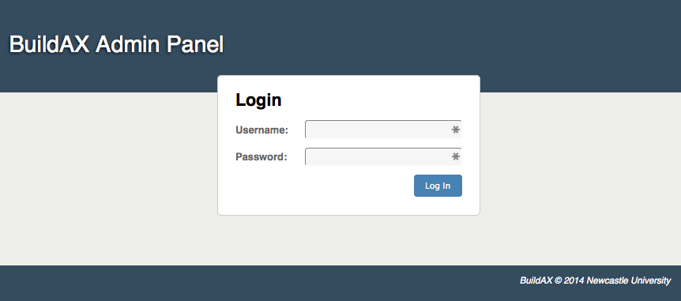
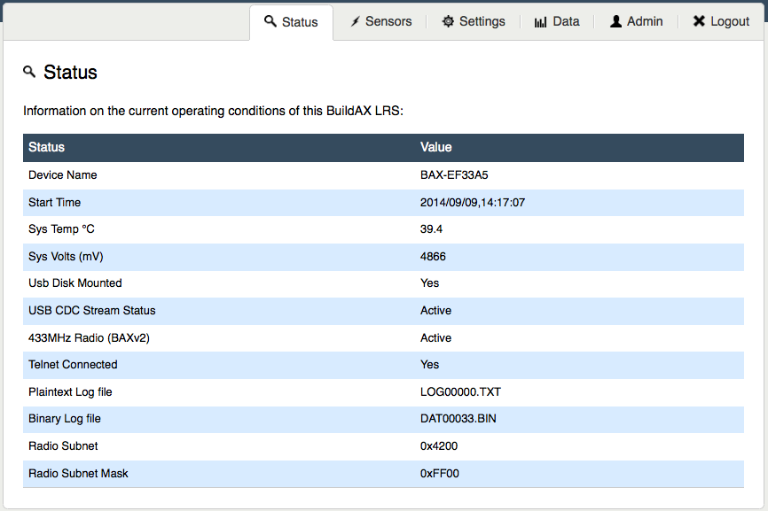
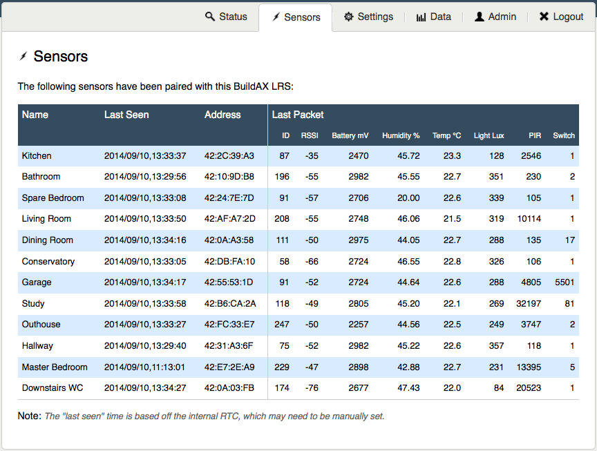
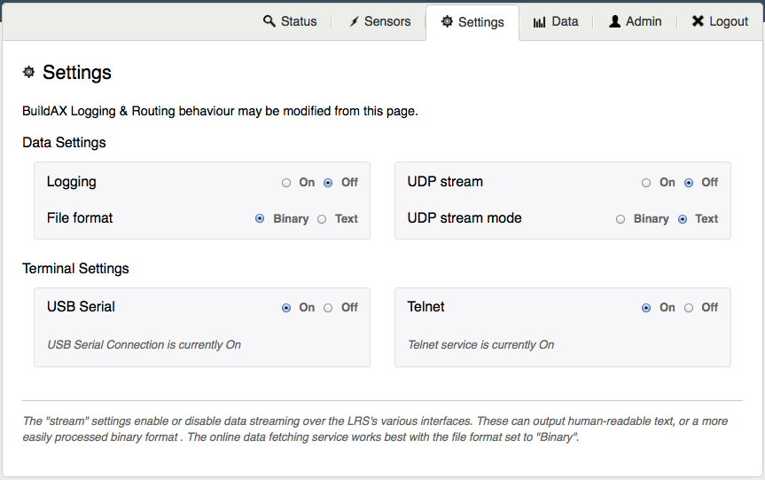
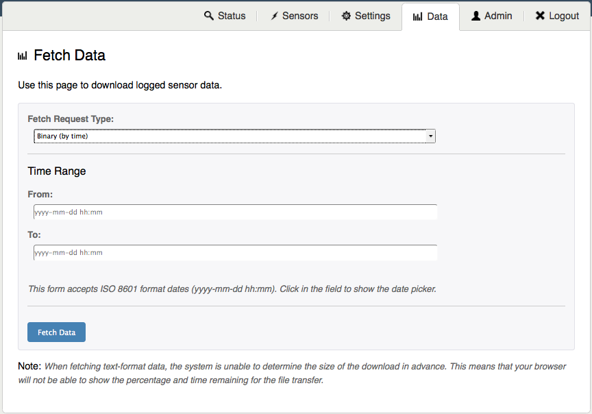
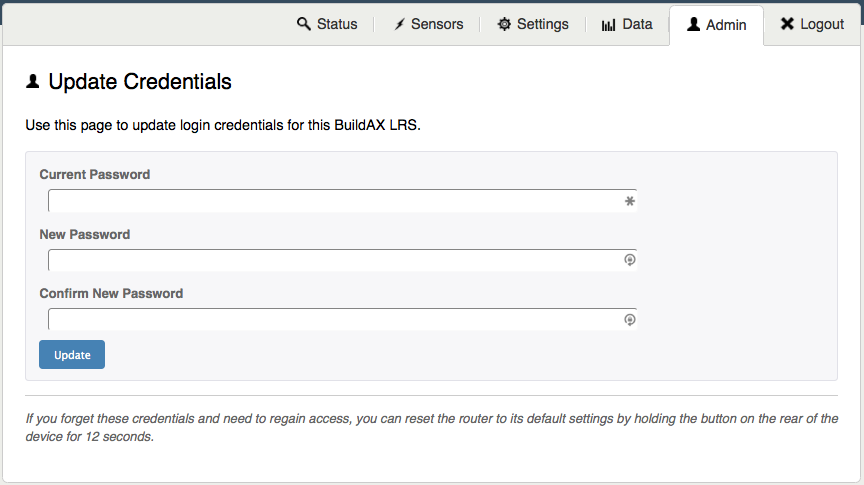

[//]: # (Web Admin Panel User Guide)

# BAX Router Admin Panel

A web configuration interface is provided to make setting up a BuildAX 
installation easier. This document gives an overview of the admin panel 
functionality.

All modern, standards-compliant web browsers are supported. Older browsers may
experience reduced functionality, for example Microsoft Internet Explorer
version 8 or lower. A warning message will be displayed in this case.

## Login

The router configuration interface is protected with a username and password. 
These should be updated from the Admin panel when you first log into the site.

 

The default login credentials for the BAX Router are:

*   Username: admin
*   Password: password

For information on how to change these credentials, see [here](#admin).

## Status 

The Status tab is the landing page for the system, and allows users to verify
the running state of the device, including the log file (binary or plaintext)
and the status of router peripherals.

 

## Sensors

The Sensor display page shows the sensors connected to the System, along with
their details and the last values received.

 

### Name

The name of the BAX sensor device can be set when it is programmed, and will be
sent as part of the encryption key transmission at pairing time. This is stored
along with the key on the root of the SD card (external storage), and as such
can be subsequently modified. The maximum length of a sensor node name is 32
characters.

### Last Seen

The last time a packet was received from a sensor, as defined by the internal
RTC on the BAX router.

### Address

The unique hardware identifier of the BAX sensor. This is generated at random 
by the sensor, but the pool of values (48-bit) is large enough to make 
collisions very unlikely.

### Last Packet

The last packet field is broken down into the individual values broadcast by 
the sensor:

Field      | Description 
---------- | --------------------
ID         | Packet identifier (sensors send packets incrementally).
RSSI       | Received Signal Strength Indication. Can be used when troubleshooting sensor drop-outs.
Battery mV | Battery level, in millivolts, of the BAX sensor. Also useful for troubleshooting connection issues.
Humidity % | Relative Humidity (a percentage of the saturation vapor pressure)
Temp °C    | Temperature in degrees Celsius
Light Lux  | Luminous flux measurement
PIR/Switch | Activation counts of the Passive Infrared sensor and magnetic switch on the device.

Different versions of BAX nodes may be produced without certain sensors—for
example, without the light or PIR sensors—to function as lightweight
environmental monitoring nodes. In this instance, a value of zero will be
displayed where data is missing.

### Limitations

Sensors appear in this table while their encryption keys are loaded into RAM on
the Router. As the amount of RAM on the device is limited, only the most recent
20 sensors will be displayed in this table. This may become possible with future
hardware revisions.

## Settings

The BAX router has the ability to route streams of data to various different
data sources. The Settings page is used to turn on/off different streams, and
switch between streaming formats (binary or plaintext). The form is arranged by
stream type.

 

When a setting has been changed, it needs to be applied before it becomes
active. The Update button will appear when a setting needs to be applied.

 

If successfully applied, you will see the confirmation dialog appear below the
settings form:

 

## Fetch

Data can be retrieved from the router remotely via the fetch interface. The form
on the Data tab is used to format requests to the router.

 

Fetch types relate directly to the logging types- if your router is logging in
plaintext mode you should use the plaintext fetch- the same goes for if the
router is logging in binary.

The Fetch form exposes four different ways to request data:

- Date/Time
- File
- Sample Number (as a range)
- Last N Samples (from most recent backwards)

In addition, if the router determines that the parameters entered do not
translate to an acceptable range, an error 400 (Bad Request) will be returned.

## Admin

To update the login credentials for the router, simply fill in the form on the
Admin tab. There are no hard-coded complexity requirements for the password, but
normal convention should be followed. The maximum password length is 32
characters.

 

Note that if this password is forgotten, it must be reset by physically
accessing the router and loading the default settings. This reset procedure can
be performed by holding down the button on the rear of the router for 12
seconds.
